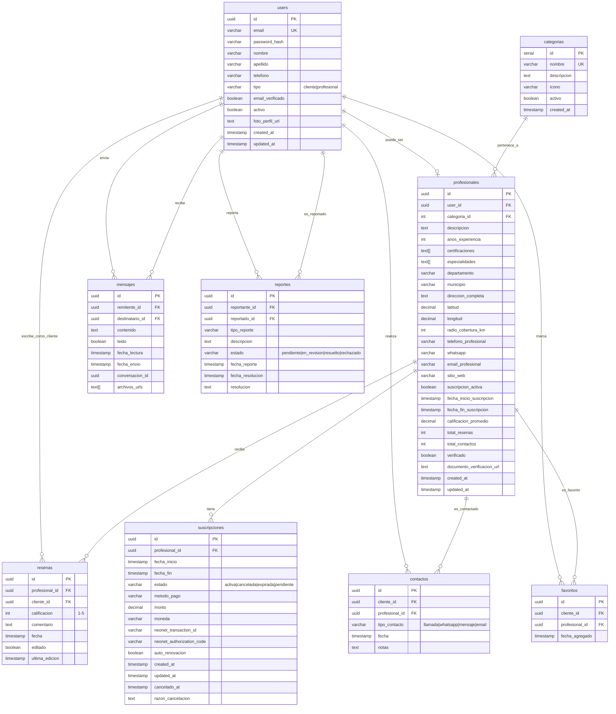
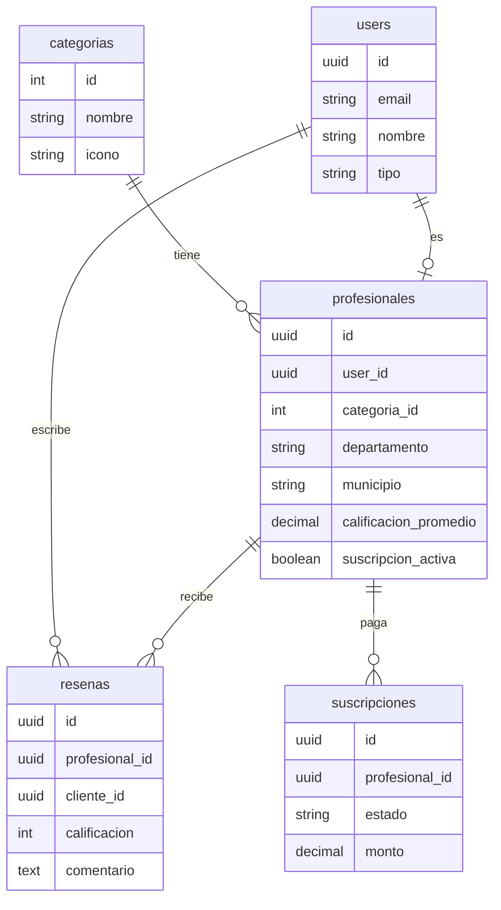
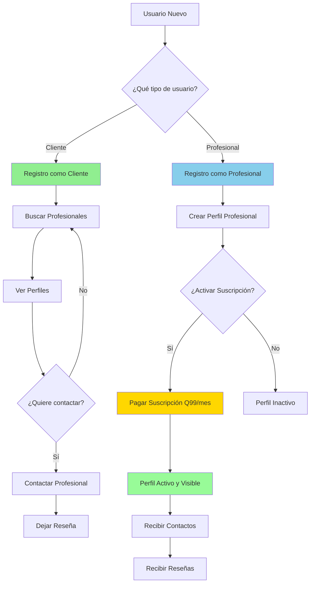
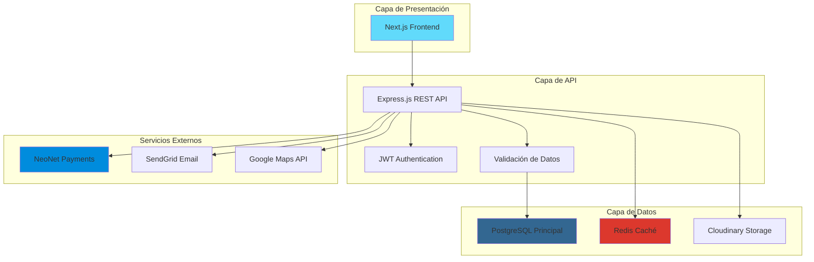
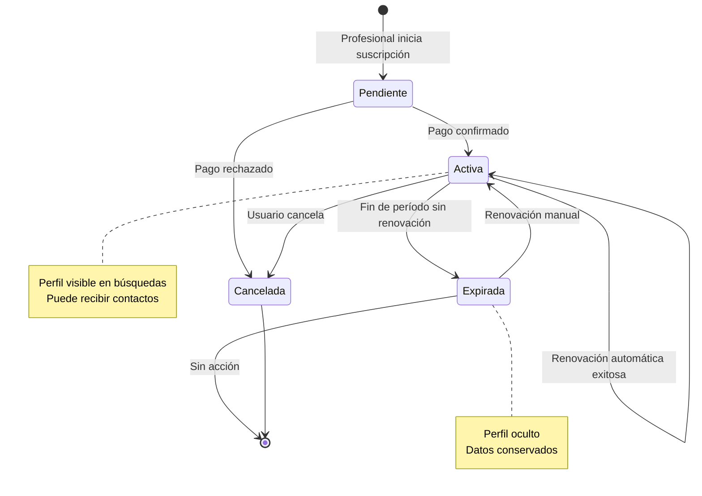
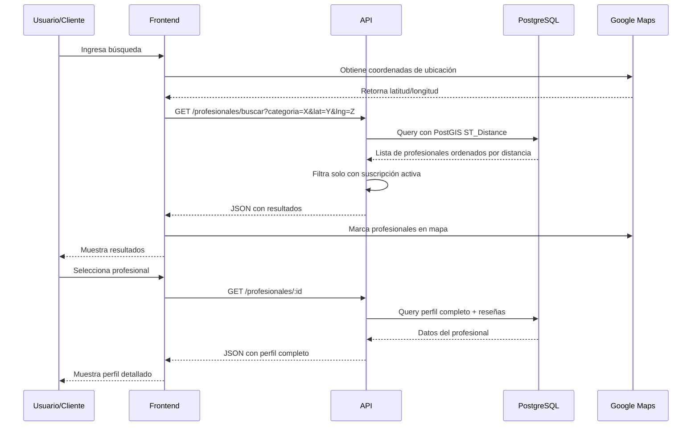

# Diagrama Entidad-Relación - ConectaPro Guatemala

Este archivo contiene el diagrama del modelo de datos en formato Mermaid.
Puede ser visualizado en GitHub, herramientas compatibles con Mermaid, o exportado como imagen.

## Diagrama ER Completo

## Diagrama Simplificado (Relaciones Principales)

## Diagrama de Flujo de Usuario

## Arquitectura de Datos por Capa

## Ciclo de Vida de una Suscripción

## Proceso de Búsqueda Geolocalizada

